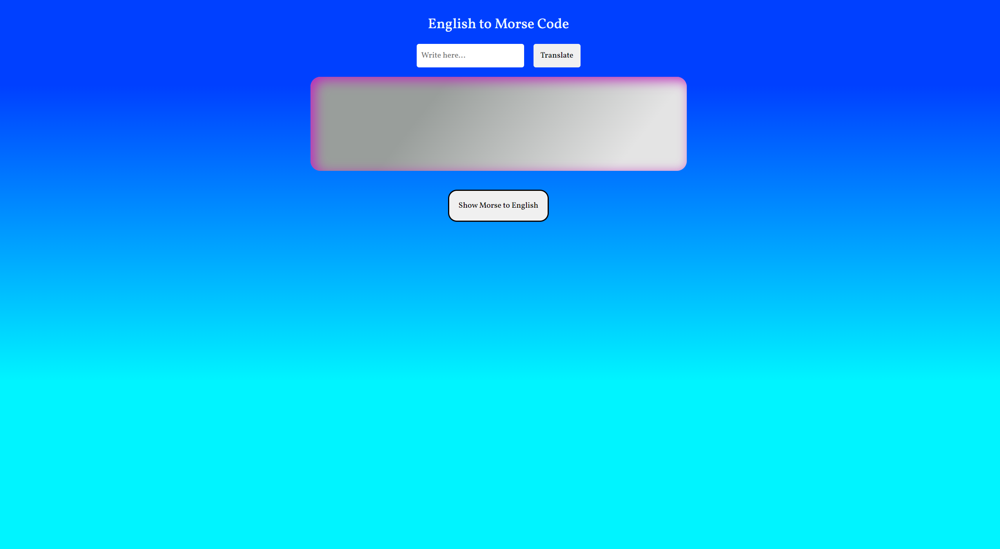

# morse-code-translator

## Table of Contents

- [About](#about)
- [Getting Started](#getting_started)
- [Usage](#usage)
- [Contributing](../CONTRIBUTING.md)

## About 

The purpose of this project was to create a simple web app that could translate English into Morse Code. The front end of the project was built using HTML, CSS and SCSS. The functionality and how the inputs are translated into Morse is done through JavaScript.

## Getting Started 

Click <a href="https://connz17.github.io/morse-code-translator/">here</a> is a link to the live site

## Usage 

Once on the site, you will be able to enter in a word in the input box, and then press the translate button to populate the field underneath with the Morse Code translation of your written word. 

If you wish to translate a word from Morse Code back into English click on the 'Show Morse to English' button and another translator will appear below. This works the same way the first translator did but instead, taking in Morse Code in the input section and returning the English translation. To close the second translator click on the red cross underneath the output field.

### Screenshots

